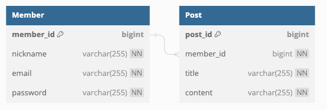

# wanted-pre-onboarding-backend
원티드 8월 프리온보딩 인턴십

지원자: 천진우

woojin8787@gmail.com

# API 문서
http://ec2-43-201-102-242.ap-northeast-2.compute.amazonaws.com:8080/swagger-ui/index.html#/

# API End Point
http://ec2-43-201-102-242.ap-northeast-2.compute.amazonaws.com:8080/

# 애플리케이션의 실행 방법
docker hub 에 배포되어 있습니다.

추가적인 docker hub 업로드가 필요하다면 다음 커맨드로 jib 를 실행합니다.

```bash
$ ./gradlew jib
```

운영을 위한 환경 변수는 .env 파일에 저장하고 보관합니다.

이후 docker-compose 로 docker 이미지를 받고 서버를 실행합니다.
```bash
$ docker-compose up -d
```

# 데이터베이스 테이블 구조


# 데모 링크 (유튜브)
https://youtu.be/AVXSaNhQtfM

# 구현 방법 및 이유에 대한 간략한 설명
- 간단한 게시판 CRUD 입니다.

- 인증은 Interceptor 와 JWT 를 사용했습니다.

- 전체 API 에 테스트코드가 포함되었으며, TDD를 준수하며 개발하였습니다.

- 예외처리는 다음과 같은 기준으로 진행하였습니다.
  - Request Body: jakrta bean validation
  - Entity: Spring Boot Assert
  - Database: MySQL 제약조건

# (완료) 요구사항
### (완료) 과제 1. 사용자 회원가입 엔드포인트
- (완료) 이메일과 비밀번호로 회원가입할 수 있는 엔드포인트를 구현해 주세요.
- (완료) 이메일과 비밀번호에 대한 유효성 검사를 구현해 주세요.
- (완료) 이메일 조건: @ 포함
- (완료) 비밀번호 조건: 8자 이상
- (완료) 비밀번호는 반드시 암호화하여 저장해 주세요.
- (완료) 이메일과 비밀번호의 유효성 검사는 위의 조건만으로 진행해 주세요. 추가적인 유효성 검사 조건은 포함하지 마세요.

### (완료) 과제 2. 사용자 로그인 엔드포인트
- (완료) 사용자가 올바른 이메일과 비밀번호를 제공하면, 사용자 인증을 거친 후에 JWT(JSON Web Token)를 생성하여 사용자에게 반환하도록 해주세요.
- (완료) 과제 1과 마찬가지로 회원가입 엔드포인트에 이메일과 비밀번호의 유효성 검사기능을 구현해주세요.

### (완료) 과제 3. 새로운 게시글을 생성하는 엔드포인트

### (완료) 과제 4. 게시글 목록을 조회하는 엔드포인트
- (완료) 반드시 Pagination 기능을 구현해 주세요.

### (완료) 과제 5. 특정 게시글을 조회하는 엔드포인트
- (완료) 게시글의 ID를 받아 해당 게시글을 조회하는 엔드포인트를 구현해 주세요.

### (완료) 과제 6. 특정 게시글을 수정하는 엔드포인트
- (완료) 게시글의 ID와 수정 내용을 받아 해당 게시글을 수정하는 엔드포인트를 구현해 주세요.
- (완료) 게시글을 수정할 수 있는 사용자는 게시글 작성자만이어야 합니다.

### (완료) 과제 7. 특정 게시글을 삭제하는 엔드포인트
- (완료) 게시글의 ID를 받아 해당 게시글을 삭제하는 엔드포인트를 구현해 주세요.
- (완료) 게시글을 삭제할 수 있는 사용자는 게시글 작성자만이어야 합니다.

### (완료) 추가점수
- (완료) 통합 테스트 또는 단위 테스트 코드를 추가한 경우
- (완료) docker compose를 이용하여 애플리케이션 환경을 구성한 경우 (README.md 파일에 docker-compose 실행 방법 반드시 기입)
- (완료) 클라우드 환경(AWS, GCP)에 배포 환경을 설계하고 애플리케이션을 배포한 경우 (README.md 파일에 배포된 API 주소와 설계한 AWS 환경 그림으로 첨부)
